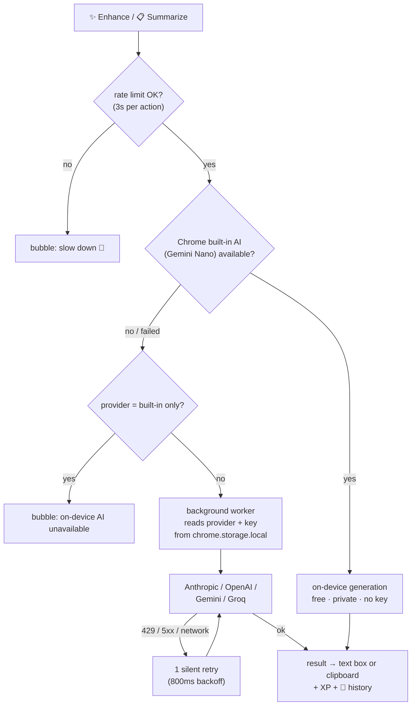
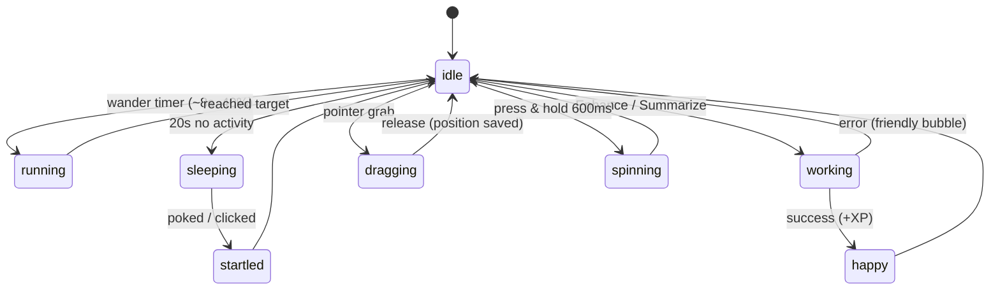
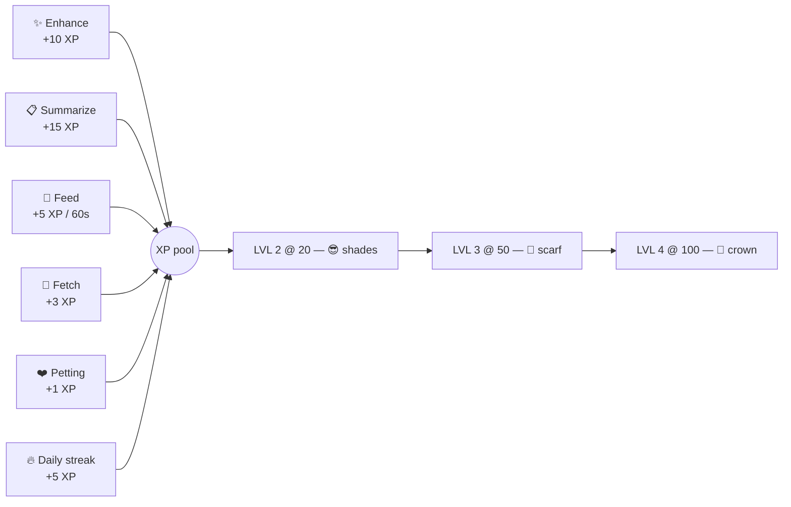

# 🦝 Rocky — Desktop Pet & AI Prompt Companion


A pixel-art raccoon that lives on every page you browse, turns your rough prompts into engineered ones, and summarizes AI chats into portable context briefs. Built as a cross-browser WebExtension (Manifest V3).

> Feed him trash prompts. He gives back treasure.

---

## Table of Contents

1. [What Rocky Does](#what-rocky-does)
2. [Status Graphs](#status-graphs)
3. [With vs. Without Prompting](#with-vs-without-prompting)
4. [Install](#install)
5. [AI Setup](#ai-setup)
6. [Interactions Guide](#interactions-guide)
7. [Leveling](#leveling)
8. [Privacy & Security](#privacy--security)
9. [Project Structure](#project-structure)
10. [Debugging](#debugging)
11. [Deployment](DEPLOYMENT.md)

---

## What Rocky Does

| Feature | What it means |
|---|---|
| ✨ **Enhance** | Rewrites the prompt in any text box into a structured, engineered prompt — 3 styles: Structured, Concise, Detailed |
| 📋 **Summarize** | Scrapes the visible AI chat (claude.ai, gemini.google.com, or any page) into a 250-word context brief, copied to your clipboard |
| ↩️ **Undo** | Restores your original text after an Enhance |
| 🍪 **Feed** | +5 XP snack with a 60s cooldown — pure game mechanic, no AI |
| 🎮 **Pet sim** | He wanders, sleeps, plays fetch (double-click anywhere), gets petted, watches your cursor, and levels up with visible accessories |


Everything persists — XP, level, name, position, settings — and syncs live across all open tabs.

## Status Graphs

### AI pipeline — how a request finds its model



### Pet behavior — Rocky's state machine



### XP economy — where growth comes from



## With vs. Without Prompting

What you type vs. what the AI coding tool actually receives after Rocky's Enhance:

**Without Rocky** (what you typed):

```
create login page please with backedn
```

**With Rocky** (Structured style):

```
GOAL: Build a working login page with backend authentication.
CONTEXT: Web app using [your stack]. No design system specified — use clean, minimal styling.
REQUIREMENTS:
1. Login form with email + password fields, labeled, with client-side validation.
2. Backend auth endpoint that verifies credentials and returns a session/token;
   wrong credentials show an inline error, never a crash.
3. Loading state on submit (disabled button + spinner); empty-field submission
   blocked with a clear message.
4. Responsive layout: usable at 360px and 1440px widths.
5. No hardcoded credentials or secrets; config via environment variables.
OUTPUT: A functional login page wired to a working auth endpoint, ready to run.
```

The enhance prompts follow established prompt-engineering practice: role anchoring, a silent analyze-before-writing process, one few-shot example to pin the format, explicit negative rules (never invent details, never bracket-spam placeholders), and verifiable requirements. See [`Bandit/ai/prompts.js`](Bandit/ai/prompts.js).

## Install

### Firefox (temporary add-on)

1. Open `about:debugging#/runtime/this-firefox`
2. Click **Load Temporary Add-on…**
3. Select `Bandit/manifest.json`
4. Refresh any open tab — Rocky appears bottom-right

### Chrome / Edge (unpacked)

> ⚠️ The manifest currently ships `background.scripts` (Firefox event page). For Chromium, change the `background` key in `Bandit/manifest.json` to `"background": { "service_worker": "background.js" }` before loading — `background.js` auto-detects either mode.

1. Open `chrome://extensions`, enable **Developer mode**
2. Click **Load unpacked**, select the `Bandit/` folder
3. Refresh any open tab

After any change to `manifest.json`, fully reload the extension from the extensions page — a page refresh is not enough.

## AI Setup

Rocky tries AI in this order:

1. **Chrome built-in AI (Gemini Nano)** — free, on-device, no key. Used automatically when available.
2. **Your own API key (BYOK)** — set in *right-click Rocky → ⚙️ Settings*.

| Provider | Key prefix | Default model | Free tier |
|---|---|---|---|
| Anthropic Claude | `sk-ant-` | claude-haiku | — |
| OpenAI | `sk-` / `sk-proj-` | gpt-4o-mini | — |
| Google Gemini | *(none)* | gemini-2.0-flash | ✅ daily quota |
| Groq | `gsk_` | llama-3.3-70b | ✅ generous, fastest |

Transient failures (network blips, rate limits, 5xx) retry once automatically before you ever see an error.

**Load balancing / failover:** keys are saved *per provider* — switch the dropdown, paste a key, save, repeat. If your primary provider fails (quota exhausted, outage), Rocky automatically fails over to the next provider you have a key for, in the same request. You only see an error when *every* saved provider fails.

Pasting a key **auto-selects the matching provider** from its prefix. The **Test key** button makes a tiny real call and shows ✅/❌ with the actual error. An optional Model field overrides the default per provider.

## Interactions Guide

| Action | Result |
|---|---|
| Type >7 chars in a text box | Rocky perks up and offers to enhance |
| **Double-click Rocky** | Enhance the focused/visible text box |
| **Right-click Rocky** | Menu: Enhance Prompt · Undo · Summarize Chat · History · Feed Rocky · Settings |
| **📜 History** | Last 10 Enhance/Summarize results — click any to re-copy it |
| **Drag Rocky** | Move him anywhere (position persists; he can't be stranded off-screen) |
| **Double-click empty page space** | Drop an apple — he runs over and eats it (+3 XP) |
| Rub cursor over him | Hearts + happy eyes (+1 XP, rate-limited) |
| **Press & hold Rocky (600ms)** | Spin trick 🌀 (30% chance of +2 XP) |
| Visit daily | 🔥 Streak bonus: +5 XP on every consecutive day |
| Idle 20s | He falls asleep; any activity startles him awake |
| Cursor anywhere | His pupils follow it |

## Leveling

| Level | XP | Unlock |
|---|---|---|
| 1 | 0 | Classic Rocky |
| 2 | 20 | 😎 Sunglasses |
| 3 | 50 | 🧣 Red scarf |
| 4 | 100 | 👑 Crown — *ALL HAIL THE TRASH KING* |

XP: Enhance +10 · Summarize +15 · Feed +5 · Fetch +3 · Petting +1.

## Privacy & Security

- Your API key is stored **only** in `chrome.storage.local` on your machine, and is sent **only** to your chosen provider's official endpoint, from the extension's background worker — never from page context, never to anyone else.
- Rocky's UI lives in a **closed shadow DOM** — host-page scripts cannot reach inside it (e.g., to read the API-key field in the settings modal).
- All provider/page-derived text is HTML-escaped before rendering in Rocky's bubbles — a malicious error string can't inject markup.
- Nothing is logged in normal operation. Debug mode logs provider name + latency only — **never** prompt text or keys.
- No analytics, no tracking, no external servers of ours.
- Page content is read only when *you* trigger Enhance (the text box) or Summarize (visible chat).

## Project Structure

```
Bandit/
├── manifest.json        # MV3, cross-browser (gecko id + host_permissions)
├── content.js           # Injects Rocky into pages via Shadow DOM host
├── script.js            # Pet behavior, drag physics, XP, menu, settings
├── storage.js           # Single-key persistent state, debounced, cross-tab sync
├── background.js        # Service worker/event page — the only place keys live
├── styles.css           # Pet + UI styles (:root,:host for shadow DOM)
├── index.html           # Standalone demo page + injected pet markup
└── ai/
    ├── pipeline.js      # rockyAIPipeline(): Nano first → BYOK fallback
    ├── providers.js     # 4-provider registry, 3 format adapters
    └── prompts.js       # Enhance (3 styles) + Summarize system prompts
```

## Debugging

- On any page, set `localStorage.rocky_debug = "1"` in DevTools → console logs show which provider handled each call and latency.
- Load failures show a red banner bottom-right with the actual error — no DevTools needed.
- Background worker showing **Stopped** in `about:debugging` is normal MV3 idle behavior; it wakes on the next message.
